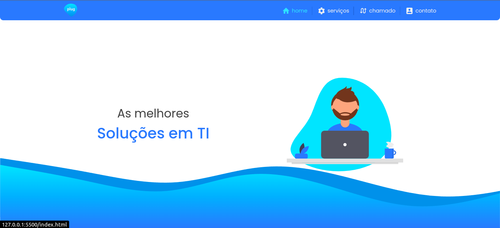

## Plug Informática - Website 

Sistema institucional responsivo relacionado a uma empresa de Suporte em TI, criado com as tecnologias HTML, CSS, Sass, JavaScript e jQuery.

## Tecnologias utilizadas 💻

    
    
    
    
    
       

## Objetivo do projeto 🚀

- Organizar e implementar o estilo do sistema através da linguagem Sass.
- Criar animações utilizando a biblioteca jQuery em conjunto com a ScrollReveal.
- Realizar animações dinamicas usando a biblioteca Animate.css
- Implementar técnicas de UX/UI Design no sistema.

## Preview 📷

## Link do website 🌎

https://plug-informatica.netlify.app/
